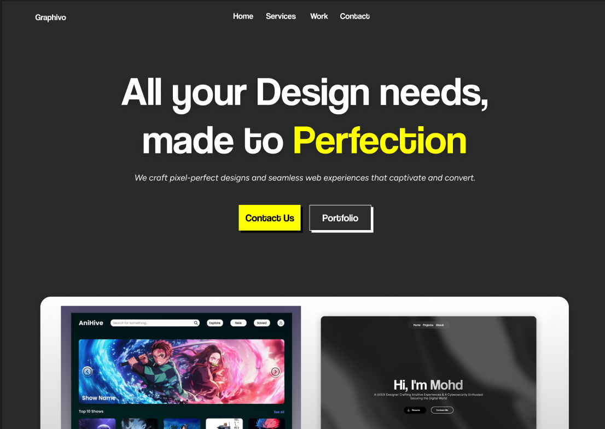
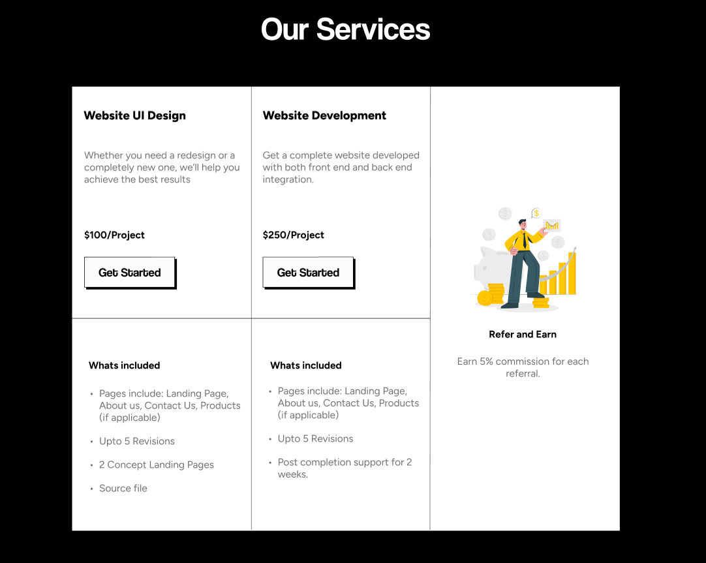
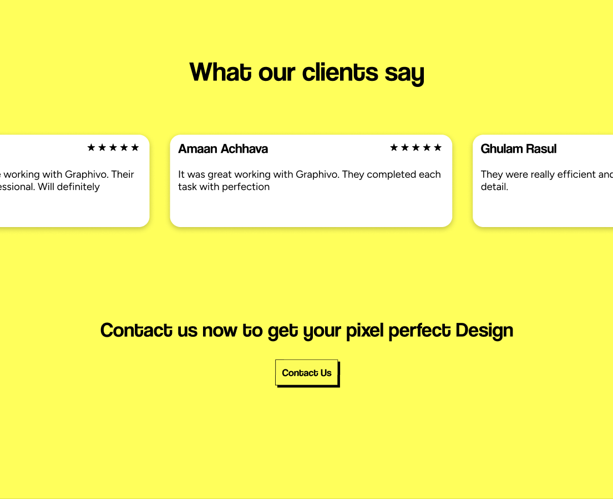
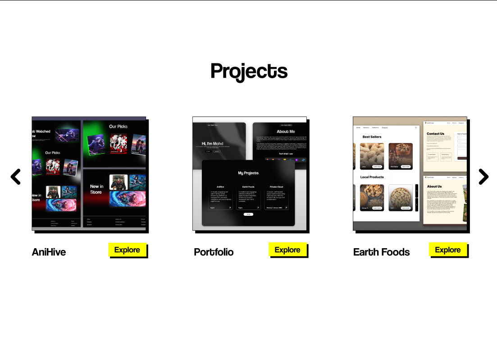
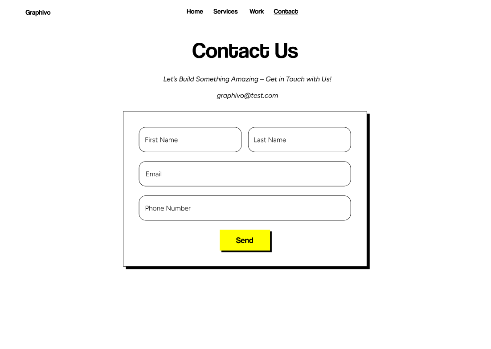

# 🌟 Graphivo – UI & Web Development Agency  

Graphivo is a modern UI and web development agency dedicated to crafting beautiful, functional, and user-centric designs. This project showcases a sleek and engaging landing page, along with essential sections like services, testimonials, and projects.

## 🚀 Features  
✅ **Landing Page** – A stunning introduction to Graphivo’s expertise  
✅ **Services Section** – Showcasing core UI/UX and web development offerings  
✅ **Testimonials** – Real feedback from satisfied clients  
✅ **Projects Section** – A glimpse into our previous work  
✅ **Contact Us Page** – Easy communication with potential clients  

## 🖌️ Tech Stack  
- **Design**: Figma / Adobe XD (if applicable)  
- **Frontend**: HTML, CSS, JavaScript (mention framework if used)  
- **Animations & UI Enhancements**: (e.g., GSAP, Tailwind, Framer Motion)  

## 🎨 Screenshots  

### 📍 Landing Page  
  

### 📍 Services Section  
  

### 📍 Testimonials Section  
  

### 📍 Projects Section  
  

### 📍 Contact Us Page  
  

